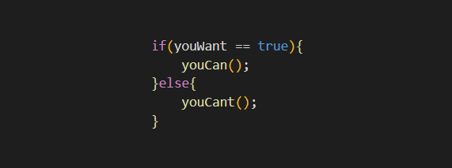

# Hello, everyone! 

My name is Jorge Serrano and I'm a front-end developer. I'm from Spain, 21 years old and I'm currently working in Indra. I'm also studying a Computers Science degree in the Universidad Carlos III de Madrid. I love reading, playing videogames, listening to music and, of course, programming.

## 🛠️ Languages and Tools:

[<code>

</code>](https://code.visualstudio.com/)
[<code>

</code>](https://www.jetbrains.com/idea/)
[<code>

</code>](https://www.jetbrains.com/pycharm/)
[<code>

</code>](https://developer.mozilla.org/en-US/docs/Web/JavaScript)
[<code>

</code>](https://reactjs.org/)
[<code>

</code>](https://docs.oracle.com/en/java/)
[<code>

</code>](https://www.python.org/)
[<code>

</code>](https://www.typescriptlang.org/)
[<code>

</code>](https://developer.mozilla.org/en-US/docs/Web/HTML)
[<code>

</code>](https://developer.mozilla.org/en-US/docs/Web/CSS)
[<code>

</code>](https://sass-lang.com/)
[<code>

</code>](https://www.json.org/json-en.html)
[<code>

</code>](https://eslint.org/)
[<code>

</code>](https://nodejs.org/en/)
[<code>

</code>](https://dev.mysql.com/)
[<code>

</code>](https://git-scm.com/)
[<code>

</code>](https://github.com/)
[<code>

</code>](https://docs.microsoft.com/en-us/windows/terminal/)
[<code>

</code>](https://www.microsoft.com/en-us/windows)
[<code>

</code>](https://ubuntu.com/)
[<code>

</code>](https://www.kernel.org/)

---

## &#x1f4c8; GitHub Stats

  
 

 

  
 

 
 ## 📫 How to reach me
You can find me on <a href="https://www.linkedin.com/in/jorge-serrano-perez/">Linkedin </a> or through my <a href="mailto:jorgeserranoperez00@gmail.com">Email</a>
 

                           
                       

